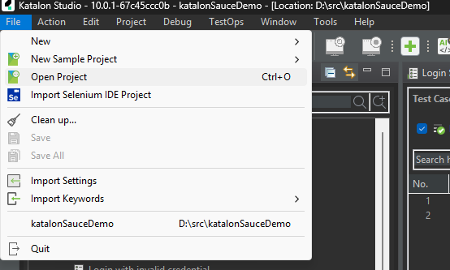
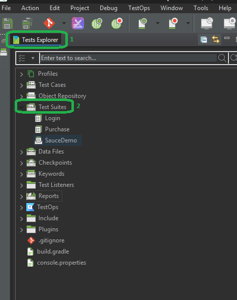
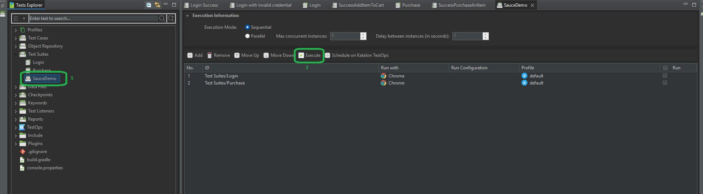
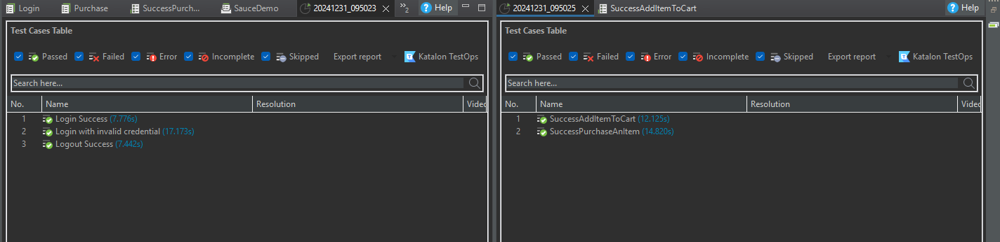

# Katalon Test Automation for SauceDemo

This project is set up to run end-to-end tests using **Katalon** for the [SauceDemo](https://www.saucedemo.com/) website. This README will guide you through the necessary steps to set up and run the tests for this project.

## Test Scenario
test scenario is taken from [this sheet](https://docs.google.com/spreadsheets/d/1An5f9VfjqyB6EDt5fIdN6qraKHl7-QirV6sRijFokho/edit?gid=0#gid=0) for the P1 only. following scenario:
1. Success to Login
2. Unable to login due to invalid credential
3. Success Add an item to cart
4. Success purchase an item

## Prerequisites

Before running the tests, make sure you have the following installed:

- Katalon Studio: Make sure you have Katalon Studio installed. You can download it from [Katalon website](https://katalon.com/download).

## Setup

1. **Clone the repository**:
   First, clone the repository to your local machine.

   ```bash
   git clone <repository_url>
   ```
2. **Open Katalon**
    Open your installed katalon

3. **Open the project**
    Open the project that were clone on step #1
    
    

## How to Run
1. Go to explorer inside katalon and go to Test Suites directory
    
2. Select SauceDemo and click Execute button
    

## Result
The result will be shown as 
    


